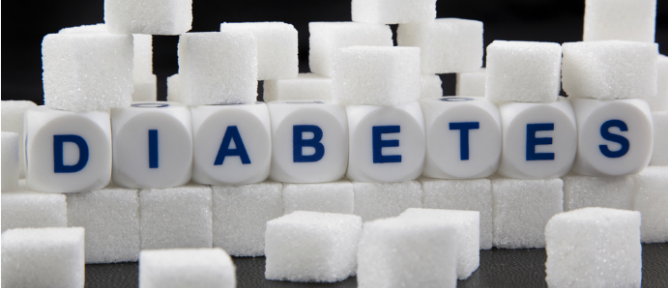
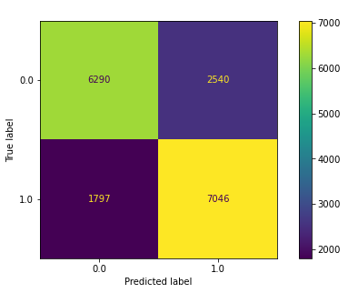
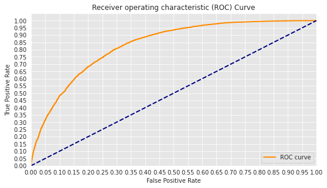

# Detecting Diabetes with Machine Learning

**Authors:** Ian Butler, Red the dog

***

## Overview

A one-paragraph overview of the project, including the problem, data, methods, results and recommendations.

This project seeks to create a publicly available tool that users can access in the home to quickly and easily identify whether they should consider further medical treatment for diabetes. For many people, going to the doctor on a hunch can be a costly decision and they may not be willing to seek diagnosis without prior justification. If our application suggests that a user might be diabetic, they may be more inclined to visit their doctor and, if they are diabetic, they can receive proper care sooner. We train multiple machine learning models on data from the Center for Disease Controls' Behavioral Risk Factor Surveillance System and recommend its deployment by any agency seeking to make testing for diabetes more accessible.

***

## Problem

A summary of the problem we are trying to solve and the questions that we plan to answer to solve it.

This summary, taken from the dataset's home on Kaggle, describes the problem quite well:

"Diabetes is among the most prevalent chronic diseases in the United States, impacting millions of Americans each year and exerting a significant financial burden on the economy. Diabetes is a serious chronic disease in which individuals lose the ability to effectively regulate levels of glucose in the blood, and can lead to reduced quality of life and life expectancy. After different foods are broken down into sugars during digestion, the sugars are then released into the bloodstream. This signals the pancreas to release insulin. Insulin helps enable cells within the body to use those sugars in the bloodstream for energy. Diabetes is generally characterized by either the body not making enough insulin or being unable to use the insulin that is made as effectively as needed.

Complications like heart disease, vision loss, lower-limb amputation, and kidney disease are associated with chronically high levels of sugar remaining in the bloodstream for those with diabetes. While there is no cure for diabetes, strategies like losing weight, eating healthily, being active, and receiving medical treatments can mitigate the harms of this disease in many patients. Early diagnosis can lead to lifestyle changes and more effective treatment, making predictive models for diabetes risk important tools for public and public health officials.

The scale of this problem is also important to recognize. The Centers for Disease Control and Prevention has indicated that as of 2018, 34.2 million Americans have diabetes and 88 million have prediabetes. Furthermore, the CDC estimates that 1 in 5 diabetics, and roughly 8 in 10 prediabetics are unaware of their risk. While there are different types of diabetes, type II diabetes is the most common form and its prevalence varies by age, education, income, location, race, and other social determinants of health. Much of the burden of the disease falls on those of lower socioeconomic status as well. Diabetes also places a massive burden on the economy, with diagnosed diabetes costs of roughly 327 billion dollars and total costs with undiagnosed diabetes and prediabetes approaching 400 billion dollars annually."

***

Questions to consider:

* What are the organization's pain points related to this project?
    * Ultimately, being able to identify diabetes quickly and early is the best defense against it.
* What questions are we trying to answer?
    * First, can we predict whether a respondent in our data has diabetes?
    * Second, if we can make this prediction, which features of the dataset are most influential in making that prediction?
    * Third, how many of those features do we need to know to make that prediction?
* Why are these questions important from the organization's perspective?
    * With respect to the first, we can determine the probability of individuals unseen by the model having diabetes.
    * With respect to the second, we can identify which of these features are most worth devoting resources to.
    * With respect to the third, we can make the simplest model possible, in order to use it as a tool or app.

***

## Data Understanding

A description of the data being used for this project.

***

Questions to consider:

* Where does the data come from?
    * This data comes from Kaggle at the following URL:
    * https://www.kaggle.com/datasets/alexteboul/diabetes-health-indicators-dataset
* How does it relate to the questions?
    * This data relates to the questions in that the survey it comes from is specifically designed to assess the following:
        * risk behaviors
        * chronic health conditions
        * use of preventive services
* What does the data represent?
    * Each record in the data represents one respondent to the Behavioral Risk Factor Surveillance System survey.
    * Each field in the data represents one question in the Behavioral Risk Factor Surveillance System survey.
* Who is in the sample?
    * The sample consists of 253,680 survey respondents.
* Which variables do we intend to use?
    * We intend to use all of the original variables in each baseline model for each type of model that we create.
    * Once we have created a baseline model for a particular type of model, we intend to iteratively increase the number of variables of subsequent models, starting from 1, until a satisfactory model performance has been achieved using as few variables as possible.

***

## Data Preparation

A description and justification of the process for preparing the data.

***

Questions to consider:
* Were there variables we dropped?
    * We have not dropped any variables at this time.
    * In future versions of the project, we intend to use as few features as possible, 
    in order to make the end application more digestible for users.
* Were there variables we created?
    * We did not create any new variables.
* How did we address missing values?
    * This dataset comes to use already clean of any missing values.
* How did we address outliers?
    * There are no outliers in this dataset.
    * The BMI feature does have an unusual distribution.

***

## Data Modeling

A description and justification of the process for analyzing or modeling the data.

***

Questions to consider:
* How did we analyze or model the data?
    * We modeled the data using four solo methods, four ensemble methods, and one neural network.
* How did we iterate on our initial approach to make it better?
    * We created grid searches with cross validation for every model we explored.
* Why are these choices appropriate given the data and the problem?
    * These choices were made to identify and settle on the best possible model, 
    given the nature of the data itself.

***

### Final Model

After iterating through the various models that we explored, 
we chose gbc2 as our final model due to it having the highest recall of all the models. 
Recall, being a measure in this case of how many true diabetics our models were able to identify, 
was more important in our desire to create a model that could capture 
as many potential cases of diabetes as possible. 
In its use primarily as a form of early screening 
for individuals concerned with having diabetes, 
we want the model to be suggest further evaluation 
in as many potential cases as possible, 
even if this means that there are a few more false positives as a result.

## Evaluation

An evaluation of how well our work solves the stated problem.

***

Questions to consider:
* How do we interpret the results?
    * Ultimately, we can say that our final model does a fairly good job 
    of distinguishing between diabetics and non-diabetics and, 
    with a recall of 80%, it can be used reliably as a first measure 
    of risk for users who don't yet want to go to the doctor 
    to investigate their concerns further.
* How well does our model fit our data?
    * Our model fits our data fairly well. 
    Moving forward, we would like to see if we can improve its performance even further.
* How much better is this model than our baseline model?
    * With our baseline model's recall of approximately 50% 
    and our final model's recall of approximately 80%, 
    our final model is detecting diabetic respondents approximately 60% 
    more frequently than our baseline model.
* How confident are we that our results would generalize beyond the data we have?
    * We are fairly confident that our results would generalize beyond the data we have.
    * One thing to note, however, is that we could likely reduce 
    the dimensionality of the features without sacrificing 
    the performance of the model. This is something we would 
    like to do in further versions of the projects.
* How confident are we that this model would benefit the organization if put into use?
    * We are fairly confident that deploying this model 
    would increase the number of people who were willing 
    to seek medical diagnosis for diabetes. 
    If our application predicts that a user has diabetes, 
    they may be more inclined to visit their doctor 
    to further explore the possibility that 
    they may have diabetes.

***

## Conclusions

A provision of our conclusions about the work we've done, including any limitations or next steps.

***

Questions to consider:
* What would we recommend the organization do as a result of this work?
    * We would recommend the CDC utilize this application online 
    as a means of making it easy for individuals at home to identify whether they may have diabtes.
* What are some reasons why our analysis might not fully solve the problem?
    * Primarily, the used dataset does not take into consideration any hereditary elements of diabetes.
    * As the data was only taken in with respect to behavioral elements (as is the purpose of the BRFSS), 
    our model is only capable of considering those same elements.
    * With hereditary elements contributing greatly to the diagnosis of diabetes, 
    our model could be dramatically improved by training it on these elements as well.
* What else could we do in the future to improve this project?
    * There are three main improvements we would like to do to improve this project in the future:
        * First:
            * We would like to reduce the dimensionality of the features.
            * Ultimately, we believe that having a simpler model will allow for a simpler intake in the application, 
            which will encourage more people to use it.
        * Second:
            * We would like to train multiple models, such that a different one could be used 
            depending on the number of known answers to the intake.
            * For example, if the final intake includes seven questions but a user only knows the answers to five, 
            there would be a model run under the hood which was trained on those five questions, specifically.
        * Third:
            * We could like to include hereditary data in the project.

***
